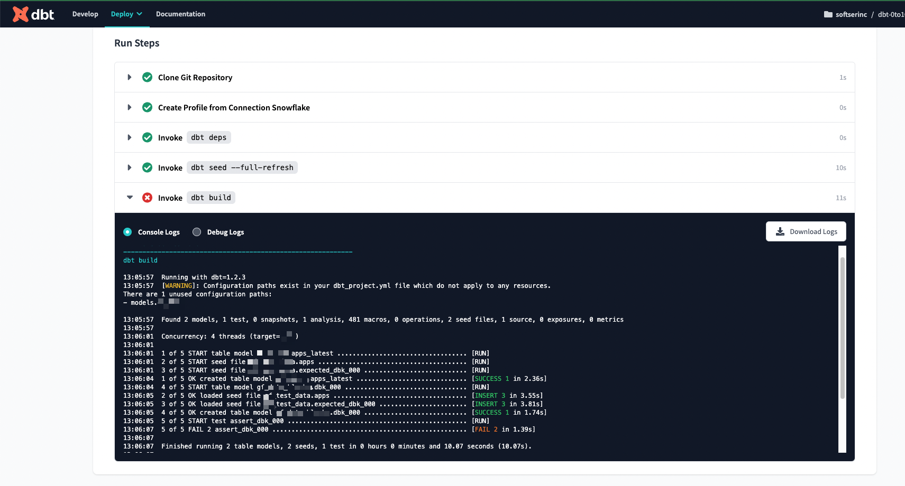
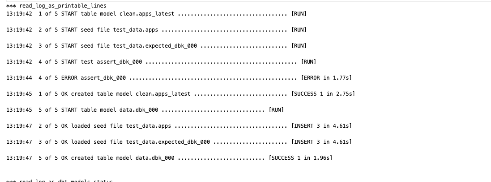
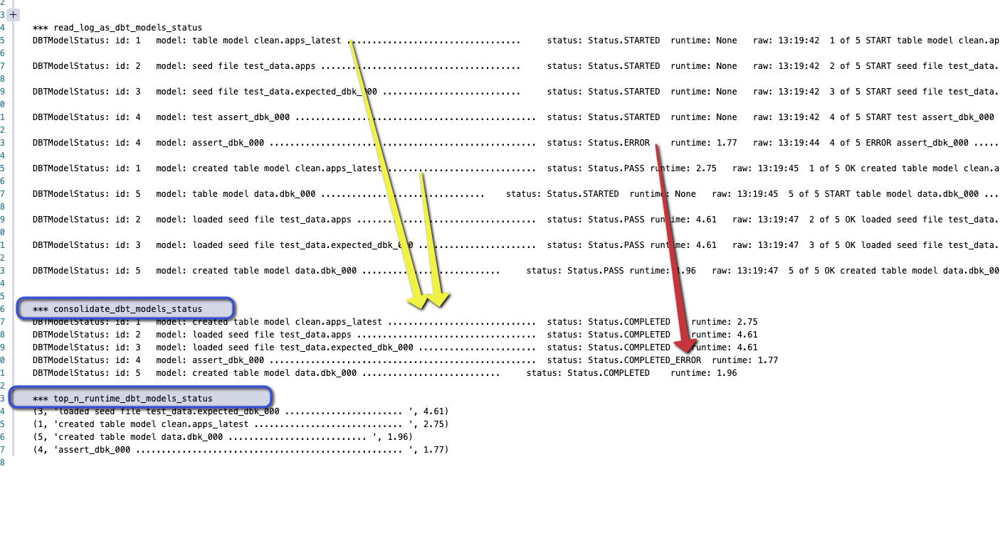

# dbt-log-jobs-parser

simple utils to parse dbt logs 

and export info on models status (id, names and runtime)

how 

you click `Download Logs` in your dbt https://cloud.getdbt.com/
ex:

you run 
the code 

and get something like this
ex:
[sample](./dbt_log_status.txt)

- no ascii codes 

- consolidated and top n by runtime :) 

